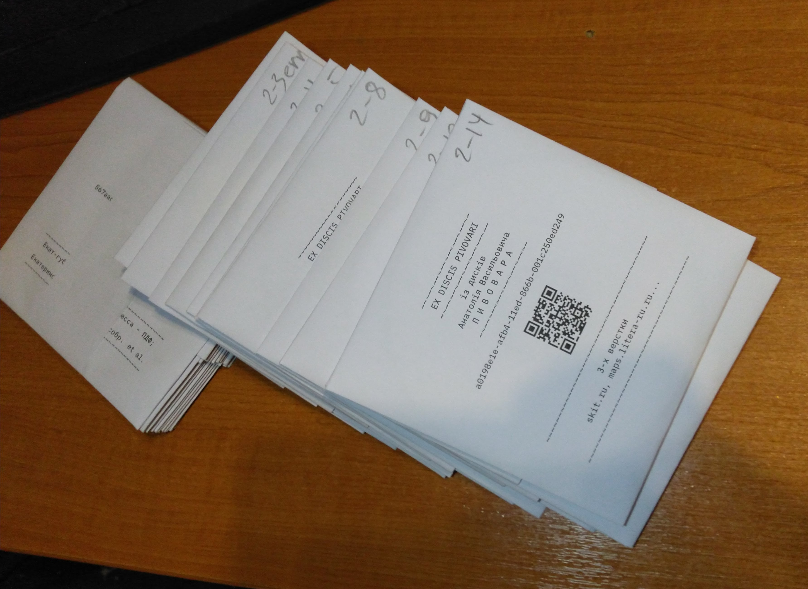

# PWWR

проект з резервного копіювання, надання доступу й організації бібліографічної обробки цифрового архіву [Анатолія Васильовича Пивовара](https://uk.wikipedia.org/wiki/%D0%9F%D0%B8%D0%B2%D0%BE%D0%B2%D0%B0%D1%80_%D0%90%D0%BD%D0%B0%D1%82%D0%BE%D0%BB%D1%96%D0%B9_%D0%92%D0%B0%D1%81%D0%B8%D0%BB%D1%8C%D0%BE%D0%B2%D0%B8%D1%87)

## 1. резервне копіювання

Цифровий архів, з погляду на носії, складається із 1) системного HDD робочого комп'ютера, 2) значної кількості оптичних CD й DVD носіїв, 3) диску NAS.

1.1. **Системний HDD** було надано дружиною А. В. для зняття образу, після чого його їй було повернуто.

Був знятий повний образ. Його може бути примонтовано для доступу до файлів, а також конвертовано в формат для віртуальної машини, щоби таким чином отримати робочий знімок системи на момент зняття образу. Останнє було протестовано.

1.2. Створення і початковий опис оптичних **CD/DVD** дисків являє найбільш трудомістську та часозатратну стадію цього етапу. Але вона є необхідною з двох причин. По-перше, диски зношуються, деякі з них вже читаються нестабільно, і якщо надати доступ безпосередньо до оригіналів, це приведе до їх знищення. По-друге, робота з фізичними дисками на подальших етапах значно утруднена порівняно із обробкою їх образів, доступ до фізичних дисків практично неможливо автоматизувати, тоді як робота з їх образами, у тому числі віддалена, досить проста. Наявність образів і мінімального їх опису дозволяє інтегрувати цю частину архіву у більші системи для реалізації наступних етапів проекту.

### загальні деталі реалізації 1.2.

- кожному диску присвоюється унікальний ідентифікаційний номер -- [UUID](https://uk.wikipedia.org/wiki/UUID) -- за яким в подальшому здійснюється доступ і посилання на нього
- `<UUID>.jpg` - робиться **фото** диску, щоб уможливити розшифровку написів на ньому без необхідності звернення до фізичного оригіналу
- `<UUID>.lbl` - напис на диску транскрибується (перший рядок файлу) і мінімально пояснюється (напр. розкриваються скорочення) та доповнюється з огляду на фактичний зміст диску -- це **"бірка"**, первинний мінімальний опис для текстового пошуку, поки диск детальніше не оброблено на наступних етапах
- `<UUID>.olrs` - сортований список файлів і директорій на диску (імена, розміри, дата останнього редагування, контрольна сума md5) -- теж для можливості пошуку по цим данним (буде додатково пояснено)
- `<UUID>.dd` - власне, **образ** файлової системи диску, що його можна примонтувати в систему й отримати доступ до файлів
- `<UUID>.dd.md5` - контрольна сума md5 для перевірки цілосності й аутентичності образу
- `<UUID>.blkid` й `<UUID>.isoinfo` - дамп роботи одноіменних утіліт -- інформація про оригінальний диск вцілому (мітки, повний розмір запису, дата запису)
- після обробки диски, які не мають індивідуальних боксів (зберігалися стопою на шпінделі), пакуються в конвертики, на яких зазначено UUID (у вигляді тексту і QR) і текст "бірки"; якщо диск має індивідуальний бокс, така інформація вкладається всередину.
- також на конверті зазначається короткий код для читання людиною і цей код заноситься в загальний список дисків, разом з UUID.
    

